# Introducción a las Redes Neuronales Artificiales

Autores: Guillermo García Cobo y Álvaro Zaera de la Fuente

## 1. Implementación de una librería para el manejo de redes neuronales

Con el objetivo de sacar el máximo provecho a estas prácticas, hemos decidido desarrollar el código de las mismas en [Julia](https://julialang.org/). Con esto, además de aprender un lenguaje nuevo, conseguimos una implementación muy eficiente de la librería que se nos requiere. Si no tiene instalado Julia, puede obtenerlo en el [siguiente enlace](https://julialang.org/downloads/).

La implementación de esta librería puede encontrarse en los paquetes `RedNeuronal_pkg.jl`, `Capa_pkg.jl`, `Neurona_pkg.jl`. Es importante comentar antes de proceder a los siguientes apartados qué consideramos un *ciclo*. Este consiste en llamadas a las funciones `Disparar` (se procesan los valores por la función de activación) y `Propagar` (se propaga la salida de una neurona a las neuronas con las que está conectada, ponderando por los pesos de estas conexiones), con la correspondiente inicialización inicial e intermedia (a $0$). La intermedia es necesaria para descargar las neuronas de sus valores de entrada actuales.

## 2. Neuronas de McCulloch-Pitts

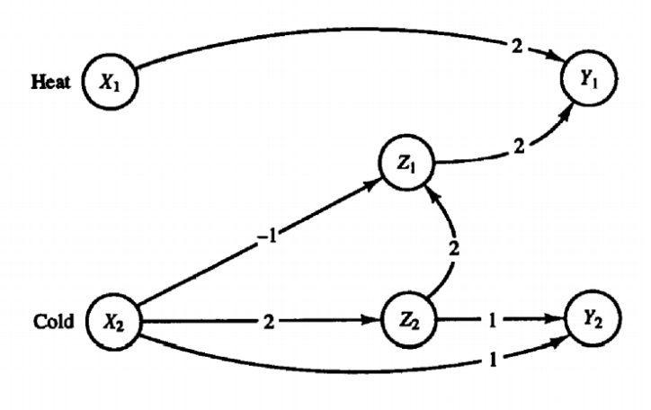

Usando la librería desarrollada en el apartado anterior, se ha implementado en `FrioCalor.jl` la red de McCulloch-Pitts que se ve en la imagen. Por tanto, las conexiones y los pesos usados en nuestro diseño son los que se incluyen en la imagen, mientras que el valor que hemos asignado al sesgo ($\theta$) es $2$.

El objetivo de esta red es producir la siguiente salida:

* $Y_1(t)$ se activa si se detecta calor en $X_1(t-1)$ o si se detecta frío en $X_2(t-3)$ pero no en $X_2(t-2)$.
* $Y_2(t)$ se activa si se detecta frío en $X_2(t-1)$ y en $X_2(t-2)$.

En términos de puertas lógicas, debemos construir lo siguiente:

* $Y_1(t) = X_1(t-1) \or (X_2(t-3) \and \neg X_2(t-2))$ 
* $Y_2(t) = X_2(t-1) \and X_2(t-2)$

Con esto en mente, el diseño es válido porque implementa las puertas lógicas que equivalen al funcionamiento buscado. Para que esto sea así, es importante fijar el valor del sesgo a $2$, dado que sino las neuronas no se activarían cuando deben. Por ejemplo, $Y_2$ solo se activa si $X_2(t-1) + X_2(t-2) \ge \theta$ , y como las entradas son binarias, es necesario que $\theta = 2$ para que la salida sea el AND buscado. El razonamiento para el OR es equivalente, solo que en este caso los pesos valen $2$ para que la salida se active cuando al menos una de las entradas esté activada. La negación la implementamos restando la entrada, ya que si esta es $0$, la resta no afecta y la neurona se activa. Concluimos entonces que el diseño es válido. Para convencernos de ello, exponemos a continuación la salida con las entradas que se proponen en el enunciado.

| $x_1$ | $x_2$ | $z_1$ | $z_2$ | $y_1$ | $y_2$ |
| :---: | :---: | :---: | :---: | :---: | :---: |
|   0   |   0   |   0   |   0   |   0   |   0   |
|   1   |   1   |   0   |   0   |   0   |   0   |
|   1   |   1   |   0   |   1   |   1   |   0   |
|   0   |   1   |   0   |   1   |   1   |   1   |
|   1   |   0   |   0   |   1   |   0   |   1   |
|   0   |   0   |   1   |   0   |   1   |   0   |
|   0   |   0   |   0   |   0   |   1   |   0   |
|   0   |   0   |   0   |   0   |   0   |   0   |
|   0   |   0   |   0   |   0   |   0   |   0   |
|   0   |   0   |   0   |   0   |   0   |   0   |

Obsérvese que la salida sigue las reglas deseadas. Esto es: 

* $Y_1(2) = 1$, ya que $X_1(1) = 1$
* $Y_2(3) = 1$, ya que $X_2(2)=1$ y $X_2(1)=1$
* $Y_1(6)=1$, ya que $X_2(4)=0$ y $X_2(3)=1$

Como hemos visto, dada una entrada, la salida de la red será la siguiente. Si la entrada muestra calor, entonces la salida de calor $Y_1$ se activará. En cuanto a la dependencia de las entradas de frío, la salida dependerá de los estados anteriores siguiendo las reglas que hemos descrito al principio de este apartado.

## 3. Lectura de datos

La funcionalidad requerida en este apartado está implementada en `LecturaDatos.jl`.

## 4. Perceptrón y Adaline

### 4.1 Problemas lógicos

A continuación mostramos las fronteras de decisión obtenidas con el Perceptrón y el Adaline para cada uno de los tres problemas lógicos resolubles linealmente:

|               Perceptrón               |               Adaline               |
| :------------------------------------: | :---------------------------------: |
| 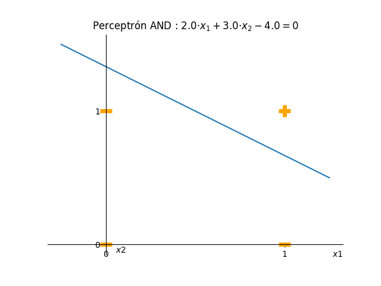  |   |
|  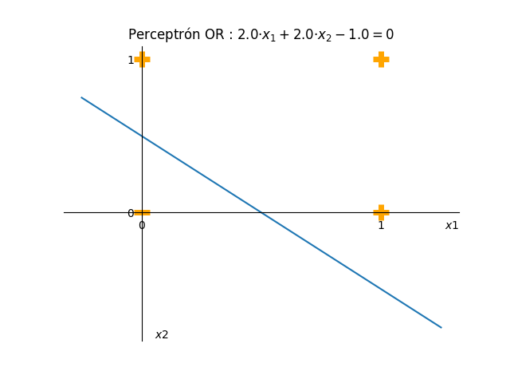  |  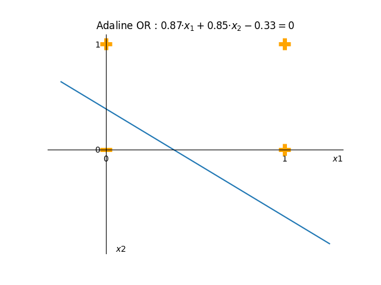  |
|  | 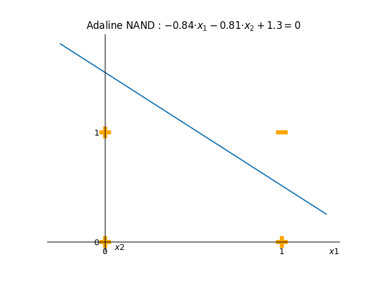 |

Como el lector habrá podido observar, hay un problema lógico que no está presente en las imágenes anteriores. Este es el XOR, que no es resoluble linealmente. Como se ve en la siguiente imagen, no es posible trazar una recta que separe las dos clases presentes.

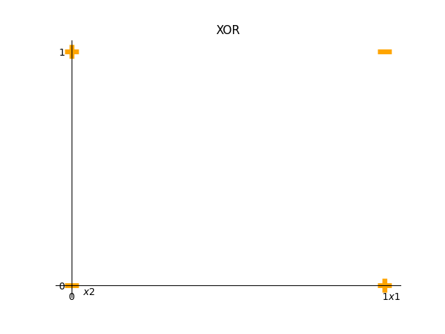

Para solucionar este problema, debemos usar técnicas que sean capaces de separar de formas no lineales las distintas clases. Una alternativa para esto es implementar una red neuronal profunda con al menos una capa oculta con activación no lineal.

### 4.2 Problema real 1

El perceptrón y adaline implementado cuentan con conexiones directas entre las neuronas de entrada y de salida, cuyos pesos se modifican en el entrenamiento. Hay tantas neuronas de entrada como variables tienen los datos (más el sesgo), y tantas neuronas de salida como número de clases queramos predecir. La implementación concreta se encuentra en `Perceptron.jl` y en `Adaline.jl`, y ambos ficheros hacen uso de `utils.jl`. 

Es importante notar que durante el entrenamiento del Perceptrón es necesario disparar la última capa, para que la salida pase por la activación correspondiente. En cuanto al Adaline, esto es necesario únicamente al hacer inferencia, ya que el entrenamiento se hace con las salidas sin activar.

Cabe mencionar que los resultados presentados a continuación no son del todo replicables, dado que se nos requiere ejecutar los algoritmos en **Modo 1**, que por definición es aleatorio en cada lectura. De todas maneras, hemos realizado varias ejecuciones por cada resultado para cerciorarnos de que las conclusiones mostradas no dependían del azar.

En primer lugar, presentamos la evolución de nuestra métrica de error (Error Cuadrático Medio) para ambos algoritmos con las configuraciones que mejor resultado han dado.

Dichas configuraciones consisten en:

* En el caso del Perceptrón, una tasa de aprendizaje de 0.025, un umbral de 0.2 y 50 épocas.

* En el caso del Adaline, una tasa de aprendizaje de 0.04, una tolerancia de 0.02 y 50 épocas.

|               Perceptrón                |               Adaline                |
| :-------------------------------------: | :----------------------------------: |
| 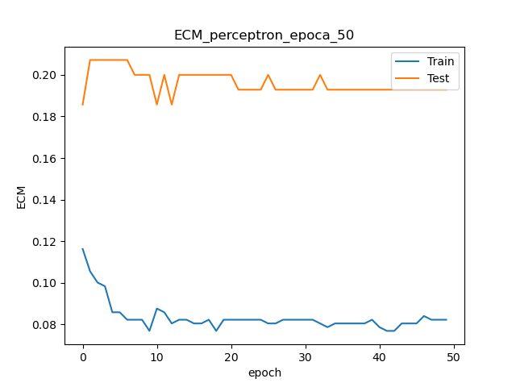 | 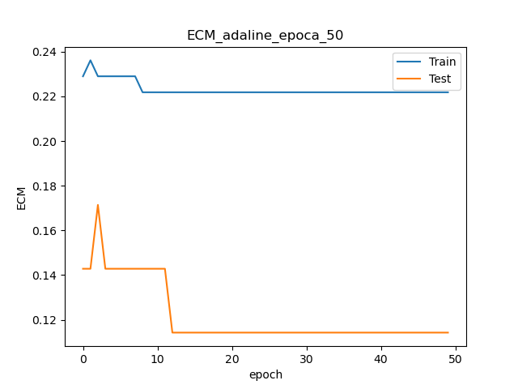 |

Es llamativa como el ECM en Adaline permanece constante tras cierto número de épocas. Creemos que esto se debe a que el algoritmo alcanza un mínimo local de la función de coste, donde el gradiente es cercano $0$. Esto se debe a que la regla de aprendizaje del Adaline minimiza el ECM usando descenso por gradiente, luego si llegamos a un punto donde el gradiente es casi nulo, no habrá apenas actualización de pesos en las iteraciones sucesivas. Observamos que este fenómeno no se produce en el perceptrón, cuyo ECM oscila en mayor medida, ya que su regla de aprendizaje no lo minimiza.

Estudiamos a continuación la influencia que tienen los distintos parámetros sobre el resultado.

En primer lugar, veamos qué sucede variando el **número de epocas**:

|                Perceptrón                |                Adaline                |
| :--------------------------------------: | :-----------------------------------: |
| 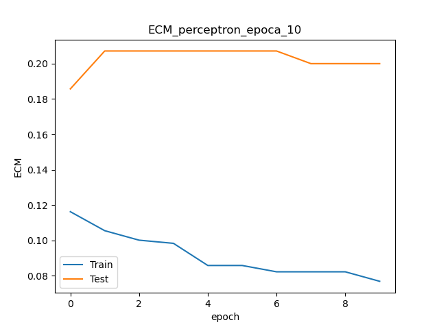  |   |
|   |   |
| 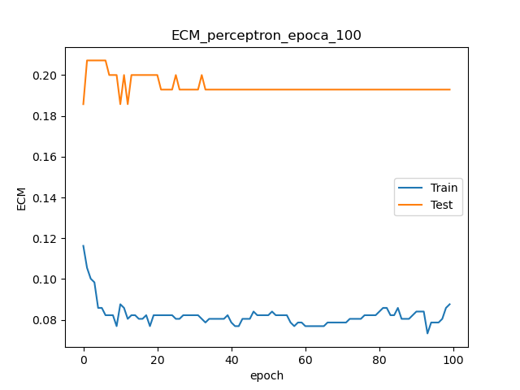 | 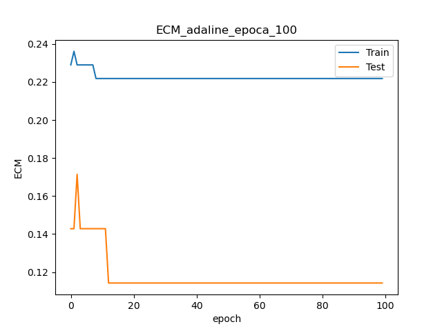 |

Observamos cómo ambos algoritmos no parecen aprender en exceso aunque aumentemos las épocas máximas de entrenamiento. Parece que ambos convergen rápidamente a los pesos óptimos (o subóptimos) y no se benefician de continuar explorando el espacio de soluciones.

En cuanto a la **tasa de aprendizaje**, los resultados son los siguientes:

|                 Perceptrón                 |                Adaline                |
| :----------------------------------------: | :-----------------------------------: |
| 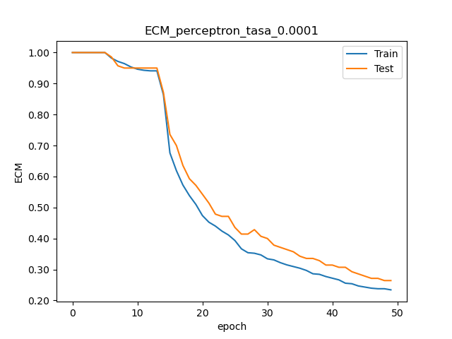 | 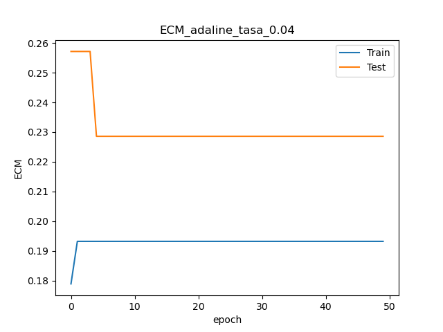 |
| 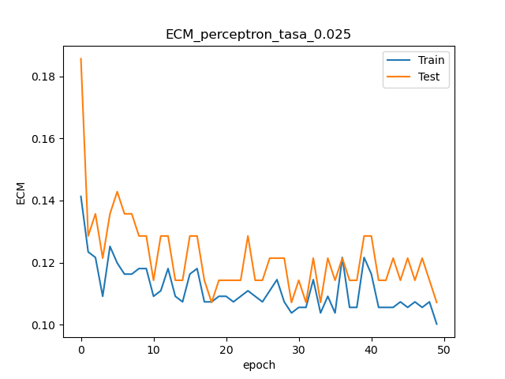  | 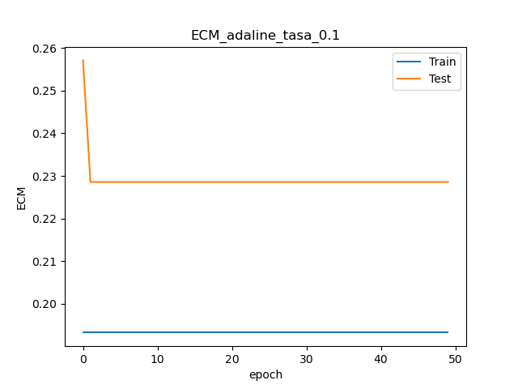  |
|  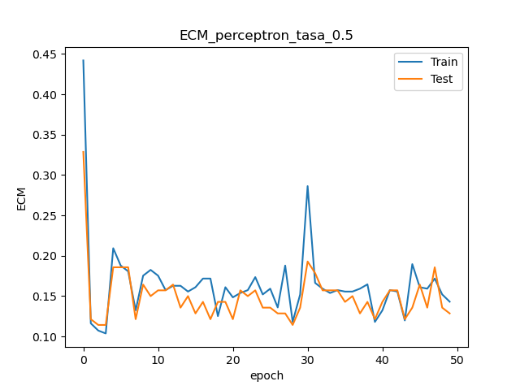   | 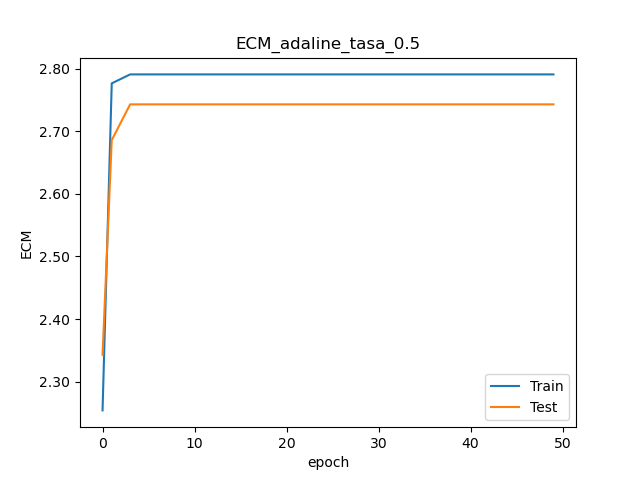  |

En primer lugar, es importante notar que los valores de las tasas que presentamos en las imágenes no son los mismos para ambos algoritmos. Esto se debe a que cada uno tiene un criterio distinto para dar por finalizado el entrenamiento, en el que la tasa de aprendizaje influye notablemente. Por ejemplo, en el Adaline, con una tolerancia fija, operar con tasas de entrenamiento bajas hace que el aprendizaje pare antes. 

En cuanto a las conclusiones que obtenemos, son las siguientes. En el Perceptrón, cuánto más agresivo se es con la tasa de aprendizaje, mayores oscilaciones encontramos durante el entrenamiento. En el Adaline, si la tasa de aprendizaje es excesiva, el algoritmo se mueve con pasos demasiados grandes por el espacio de soluciones y no aprende.

Analicemos ahora la influencia del **porcentaje** entre entrenamiento y test:

|                  Perceptrón                   |                  Adaline                   |
| :-------------------------------------------: | :----------------------------------------: |
| 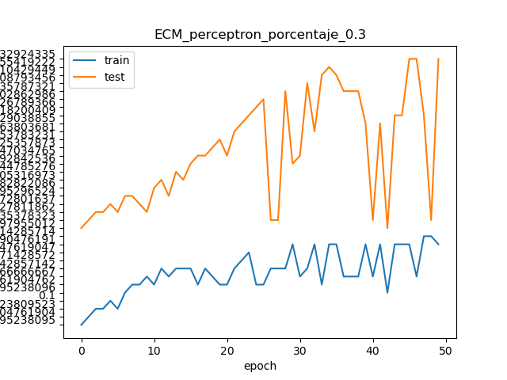 | 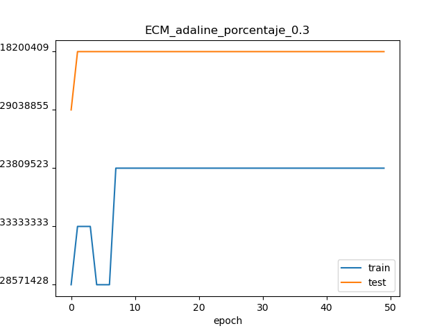 |
| 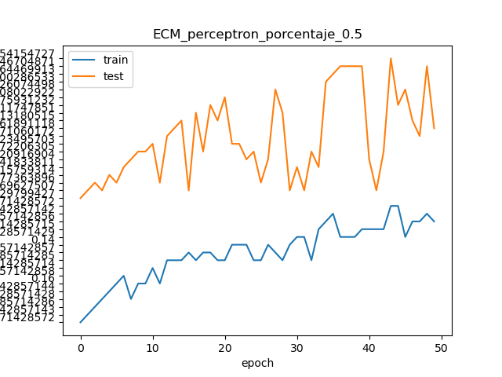 | 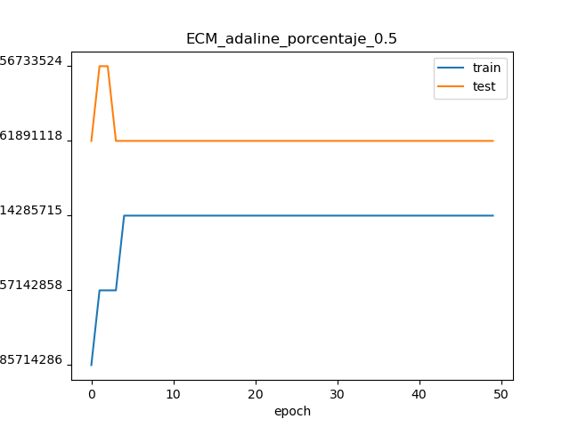 |
| 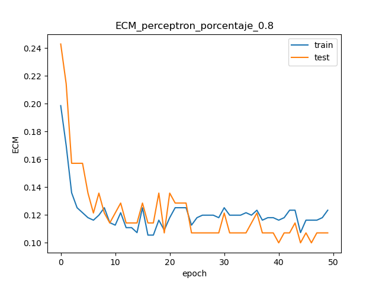 | 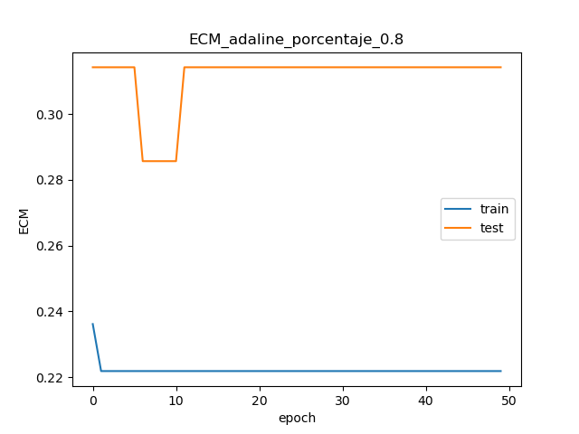 |

En el caso del Perceptrón observamos como claramente el aprendizaje mejora con creces según usamos un mayor porcentaje del conjunto de entrenamiento. 

Nuestros experimentos con la **tolerancia** nos han permitido concluir lo siguiente. Para valores muy pequeños de tolerancia, como el modelo deja de aprender pero el gradiente no es totalmente nulo (ed, hay actualización siempre de los pesos), el entrenamiento no acaba hasta que se alcanza el número máximo de épocas. Sin embargo, como el valor de estas actualizaciones se estabiliza muy rápidamente, no hay término medio. Esto es, no hay un valor de tolerancia que haga que el algoritmo se pare entre las primeras épocas y la última. No se han incluido gráficos porque, como hemos comentado, el comportamiento observado no varía entre valores. **TODO!!!**

Modificar el **umbral** del perceptrón hace que se prediga en mayor medida la clase "intermedia" $0$. Con esto, es de esperar que a mayor umbral, más estabilidad en el ECM observado, ya que la mayoría de predicciones permanecerán estables en la clase $0$ e incurrirán siempre en el mismo error. Veamos los resultados observados:

|                 Perceptrón                  |
| :-----------------------------------------: |
| 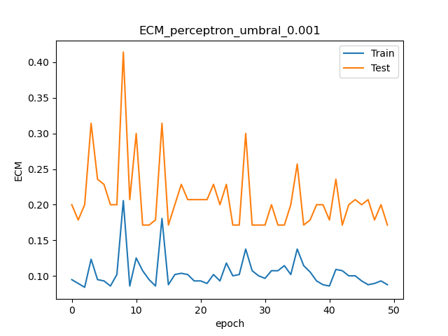 |
|  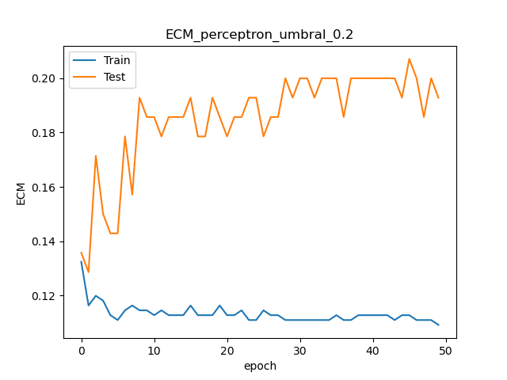  |
|  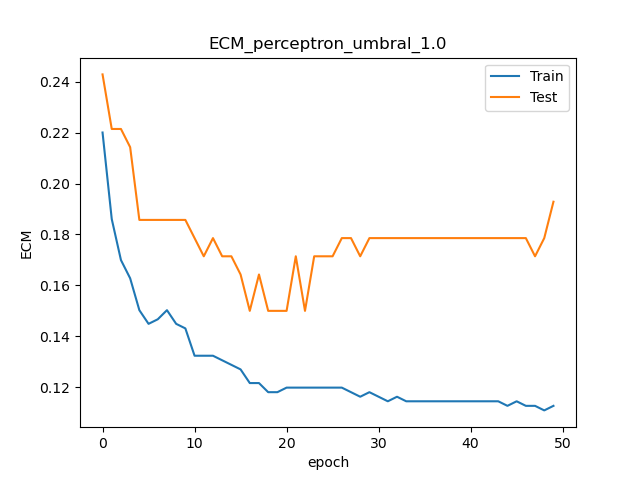  |

Vemos que efectivamente las oscilaciones son mayores con umbrales más pequeños, tal y como esperábamos. Hemos comprobado nuestro razonamiento observando también las predicciones finales del conjunto de test, obteniendo la siguiente distribución:

| Umbral | Número de pares de 0s (total 140) |
| :----: | :-------------------------------: |
| 0.001  |                 1                 |
|  0.2   |                 9                 |
|  1.0   |                15                 |

### 4.3 Problema real 2

Presentamos a continuación los resultados para el archivo `problema_real2.txt`. Hemos comprobado distintas configuraciones, llegando a la conclusión de que las mejores son:

* En el caso del Perceptrón, una tasa de aprendizaje de 0.025, un umbral de 0.2 y 50 épocas.
* En el caso del Adaline, una tasa de aprendizaje de 0.008, una tolerancia de 0.002 y 50 épocas.

|                  Perceptrón                   |                  Adaline                   |
| :-------------------------------------------: | :----------------------------------------: |
| 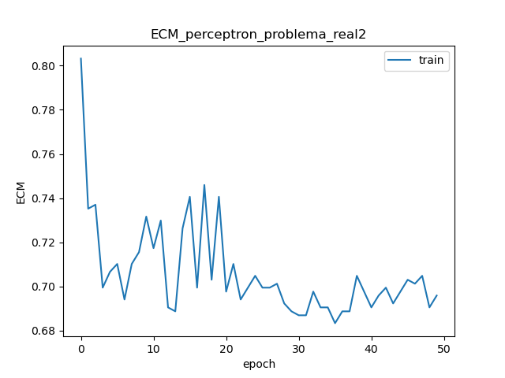 | 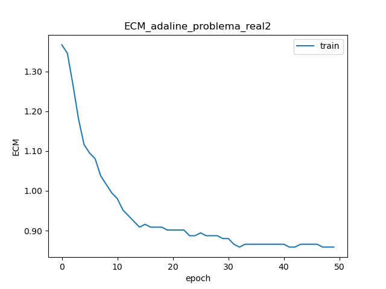 |

