# Práctica 2: Perceptrón multicapa

Autores: Guillermo García Cobo y Álvaro Zaera de la Fuente

## 1. Algoritmo de retropropagación

Para implementar el perceptrón multicapa hemos utilizado la librería de la práctica anterior que se encuentra en los paquetes `Capa_pkg.jl`, `Neurona_pkg.jl` y `RedNeuronal_pkg.jl`. A este último paquete le hemos añadido la funcionalidad necesaria para crear un perceptrón multicapa con pesos aleatorios y número de capas ocultas y neuronas completamente configurable. También, ese fichero incluye las funciones necesarias para que la red procese una entrada (`Feedforward`) y para retropropagar la salida obtenida ajustando los pesos (`Backpropagation`). Es decir, soportamos funcionalidad para aplicar el algoritmo de retropropagación en perceptrones con **varias capas ocultas**.

La función de `Feedforward` recibe un vector con los valores de entrada para la red y realiza las llamadas necesarias a las funciones de `Inicializar`, `Propagar` y `Disparar` para procesar la entrada y colocar los valores de salida en las neuronas de la última capa.

La función de `Backpropagation` asume que se ha realizado la llamada a la función anterior y ajusta los pesos de todas las neuronas teniendo en cuenta la diferencia entre los valores obtenidos como salida del perceptrón y la clase real de esa entrada. Para ello, calculamos primero el error $\delta_k$ en la salida de cada clase $k$ de la siguiente manera: $\delta_k = (t_k-y_k) f'(y\_in_k)$. 

En esa fórmula, $t_k$ es el valor real de la clase $k$ (en esta práctica es 1 si la entrada pertenece a esa clase y -1 si no), $y_k$ es la salida del perceptrón en la neurona de la última capa asociada a la clase $k$ e $y\_in_k$ es el valor de entrada de esa neurona antes de aplicar la función de activación $f.$ La nueva función de activación sigmoidal y la funcionalidad para aplicar su derivada se ha añadido al paquete `Neurona_pkg.jl`. Todos los $\delta_k$ calculados de esa manera se almacenan en un vector $\mathbf{\delta}.$

Una vez calculado el error $\mathbf{\delta}$ de la última capa, se propaga utilizando un bucle por todas las capas ocultas. En cada capa, iteramos por todas las neuronas y, para cada neurona $i$ (con entrada $z\_in_i$), obtenemos el vector de pesos $\textbf{w}$ de las conexiones que parten de esa neurona. Hallamos el error de esa capa mediante la fórmula $\delta_i=f'(z\_in_i) \cdot \mathbf{\delta}^T \cdot \mathbf{w}.$

Todos esos errores se almacenan en un vector $\mathbf{\delta_{capa}}$ que se utilizará para calcular la corrección de pesos de la siguiente capa. Además, aprovechando ese bucle, obtenemos un vector $\bold{z}$ con las salidas de todas las neuronas de esa capa.

Después, se calcula la matriz de corrección de pesos de la capa $\Delta = \alpha \cdot \mathbf{z} \cdot \mathbf{\delta}^T$ (donde $\alpha$ es la tasa de aprendizaje) y se realiza el ajuste de los pesos. Para ello, se suma al peso de la conexión entre la neurona $i$ de la capa con la neurona $j$ de la siguiente, el valor que se encuentra en la fila $i$ y columna $j$ de $\Delta$. Por último, se sustituye el vector de errores $\mathbf{\delta} = \mathbf{\delta_{capa}}$ para poder repetir el proceso de manera correcta en el resto de capas ocultas.

Este algoritmo actualiza los pesos con el objetivo de minimizar el error cuadrático medio (debido a la regla de la cadena) y se ha descrito tal y como se ha implementado. Nuestro objetivo ha sido el de implementar el algoritmo de la manera más eficiente posible partiendo de la librería utilizada, realizando el ajuste de pesos durante el algoritmo en lugar de al final (sin que esto afecte al correcto funcionamiento) y aprovechando todos los bucles para obtener la mayor información posible que sea necesaria.

El proceso de entrenamiento completo se realiza en el fichero `Backpropagation.jl` que, para cada entrada de entrenamiento, aplica la función de `Feedforward` para obtener la salida que predice el perceptrón y posteriormente, realiza la retropropagación utilizando la clase a la que pertenecen los datos y la tasa de aprendizaje indicada como parámetro. Este proceso se repite para el número de épocas indicado y, para cada época, se calcula y se muestra por pantalla la matriz de confusión, el error cuadrático medio (ECM) y la tasa de aciertos (Accuracy) para los conjuntos de entrenamiento y validación.  Además, la predicción final del percetrón sobre el conjunto de validación y la evolución de los valores del ECM y Accuracy se vuelcan a ficheros de texto al finalizar la ejecución.

## 2. Problemas reales

En esta sección, presentamos los resultados obtenidos para los problemas $1$, $2$, $3$ y $5$ para distintas configuraciones de la red. Todas las pruebas han sido ejecutadas en modo $1$ para contar con un conjunto de validación, que en todos los casos ha sido del $70\%$.

### Problema real 1

|  LR  | Épocas | Neuronas |                        ECM                        |                        Accuracy                        |
| :--: | :----: | :------: | :-----------------------------------------------: | :----------------------------------------------------: |
| 0.1  |  500   |    2     | 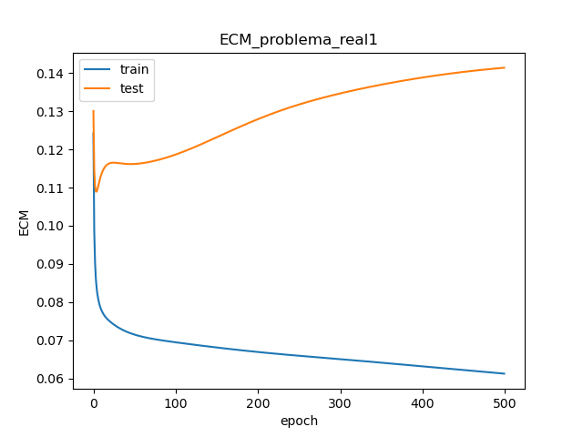  | 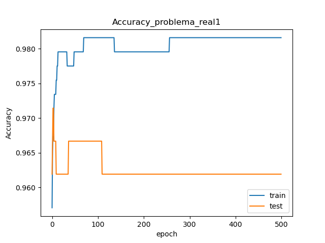  |
| 0.01 |  500   |    2     | 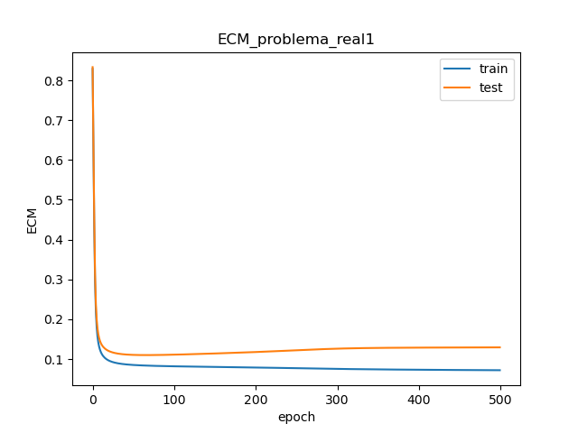 | 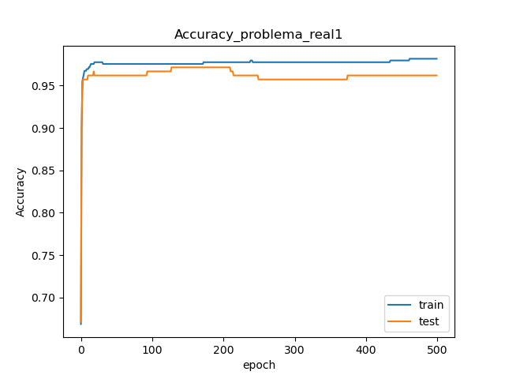 |

A la luz de los resultados, este problema parece el más sencillo de resolver. Con una configuración muy sencilla de tan solo $2$ neuronas logramos un rendimiento muy alto ($>95\%$). Probamos además distintos valores de tasa de aprendizaje (LR), observando que el *overfitting* era menor cuando decrementábamos esta tasa, aunque el rendimiento era ligeramente peor. Elegimos el modelo con menor LR porque creemos que ha sido capaz de generalizar mejor con los datos de validación. A continuación presentamos las matrices de confusión del modelo seleccionado:

|                Matriz de confusión (train)                 |                 Matriz de confusión (val)                 |
| :--------------------------------------------------------: | :-------------------------------------------------------: |
| 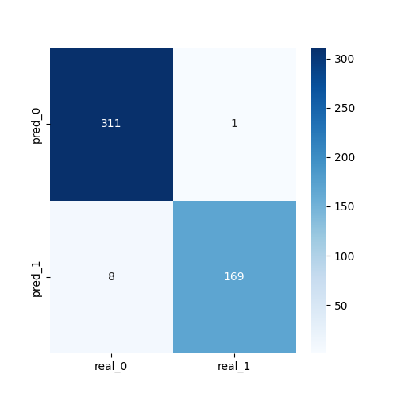 |  |

Tanto en el conjunto de entrenamiento como en el de validación observamos comportamientos similares, con un gran número de aciertos y los falsos positivos mayores que los falsos negativos en ambos casos.

### Problema real 2

Como en la sección anterior hemos concluido que el mejor LR era $0.01$, las pruebas a continuación se harán fijando este valor.

En primer lugar, probamos a aumentar el número de épocas, concluyendo que, si bien mejora ligeramente aumentando el número de épocas, la mejora no es sustancial. Por ello, las pruebas a continuación se harán con $500$ épocas.

|  LR  | Épocas | Neuronas |                          ECM                           |                          Accuracy                           |
| :--: | :----: | :------: | :----------------------------------------------------: | :---------------------------------------------------------: |
| 0.01 |  500   |    2     | 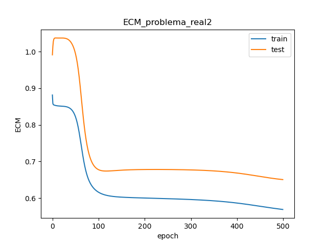  | 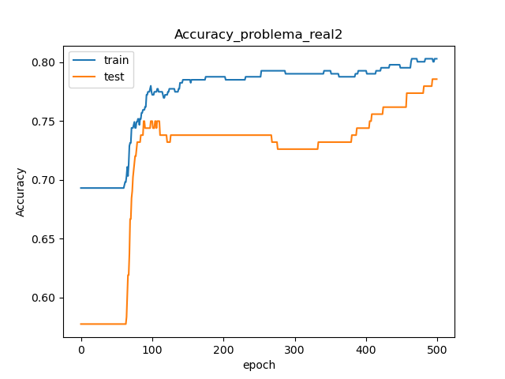  |
| 0.01 |  1000  |    2     |  | 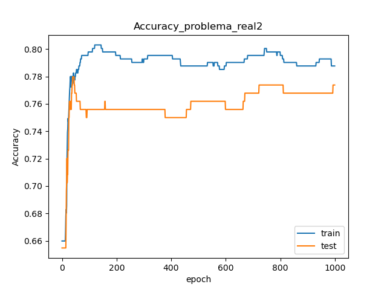 |

Como vemos en la siguiente tabla, según aumentamos el número de neuronas el ECM final de entrenamiento disminuye. Sin embargo, aumentar en exceso el número de neuronas también empeora la capacidad de generalización, tal y como se puede observar en la ejecución con $20$ neuronas. Concluimos que el mejor modelo es el de $10$ neuronas, un número lo suficientemente alto para aprender correctamente, pero lo suficientemente pequeño para no sobre-aprender.

|  LR  | Épocas | Neuronas |                          ECM                           |                          Accuracy                           |
| :--: | :----: | :------: | :----------------------------------------------------: | :---------------------------------------------------------: |
| 0.01 |  500   |    5     | 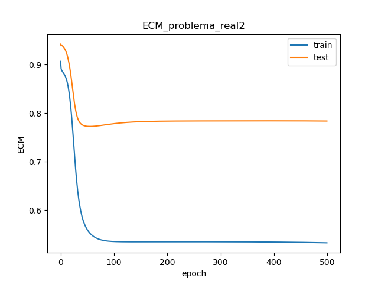  | 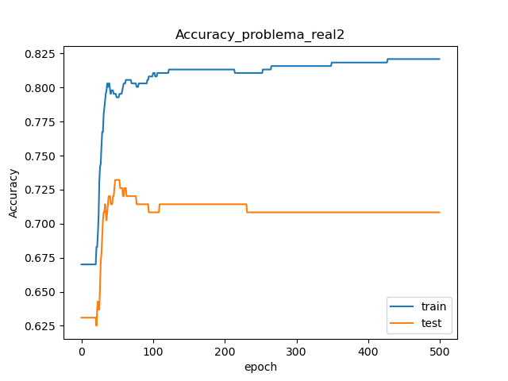  |
| 0.01 |  500   |    10    | 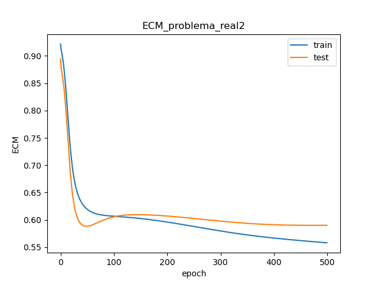 | 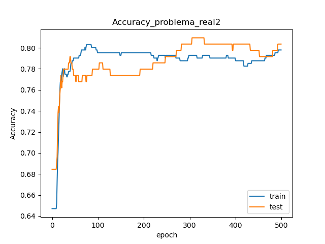 |
| 0.01 |  500   |    20    | 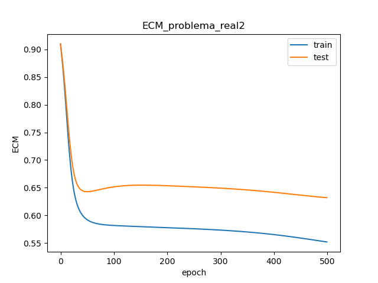 | 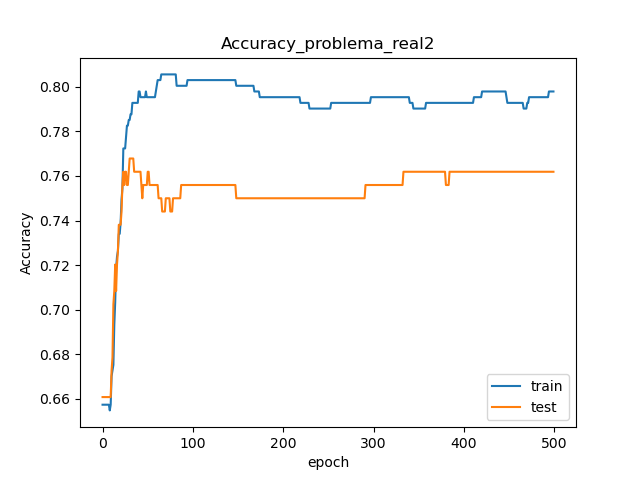 |

A continuación, presentamos la matriz de confusión para el modelo seleccionado ($10$ neuronas). Es evidente que tenemos más falsos positivos que falsos negativos, posiblemente debido a que la clase $1$ es claramente mayoritaria. Por esta razón, el modelo tenderá a predecir en mayor medida la clase $1$, y quizás no aprenda correctamente las características intrínsecas de la clase $0$.

|                 Matriz de confusión (train)                  |                  Matriz de confusión (val)                   |
| :----------------------------------------------------------: | :----------------------------------------------------------: |
|  | 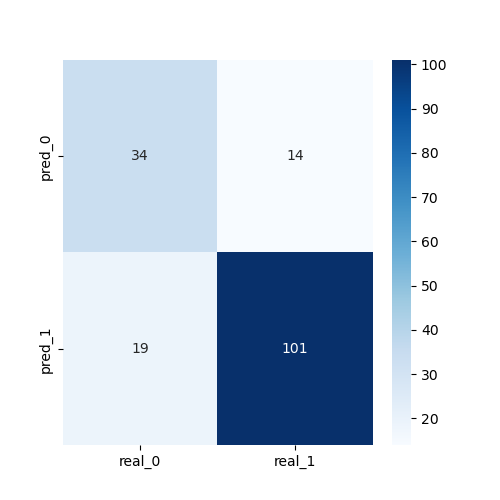 |

### Problema real 3

En la siguiente tabla observamos los resultados para distintas configuraciones sobre los datos del problema $3$. Una vez más, el número intermedio de neuronas ($5$) es el que nos da mejores resultados en cuánto a error y generalización.

|  LR  | Épocas | Neuronas |                          ECM                           |                          Accuracy                           |
| :--: | :----: | :------: | :----------------------------------------------------: | :---------------------------------------------------------: |
| 0.01 |  500   |    2     | 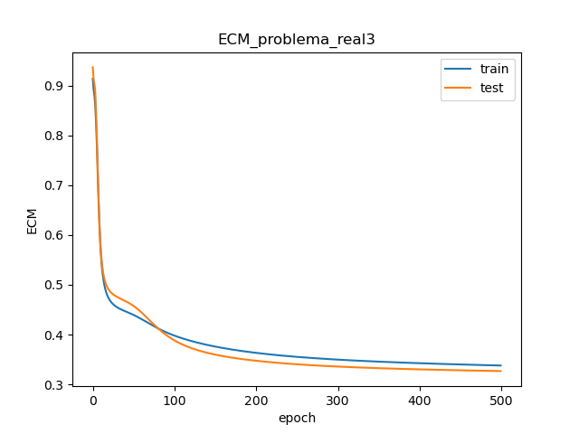  | 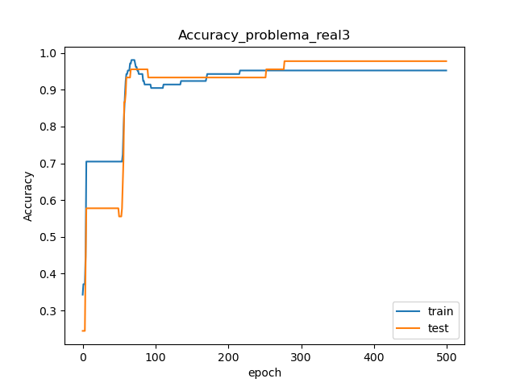  |
| 0.01 |  500   |    5     | 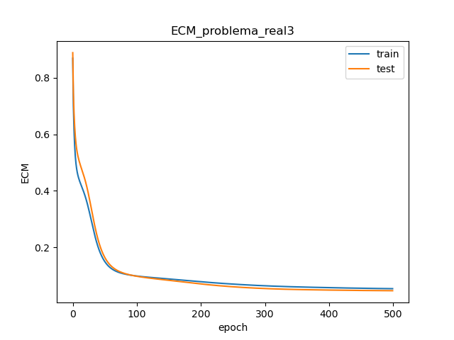  | 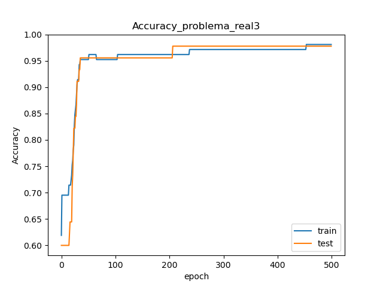  |
| 0.01 |  500   |    10    | 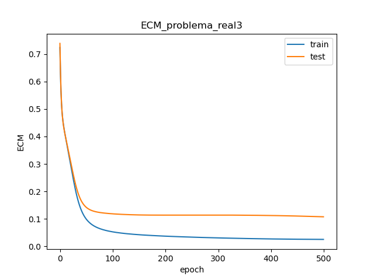 | 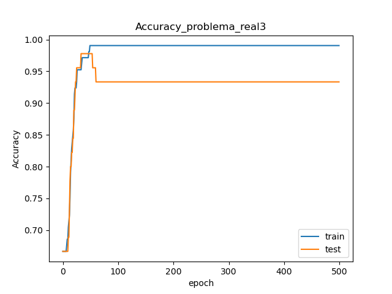 |

Una vez más, presentamos la matriz de confusión del modelo elegido. En este caso, la matriz es $3 \times 3$, ya que los datos cuentan con $3$ clases a predecir. Observamos que la clasificación es casi perfecta, y únicamente presenta un número bajo de fallos en la clase $1$, para la que el modelo predice la clase $2$.

|                 Matriz de confusión (train)                  |                  Matriz de confusión (val)                   |
| :----------------------------------------------------------: | :----------------------------------------------------------: |
| 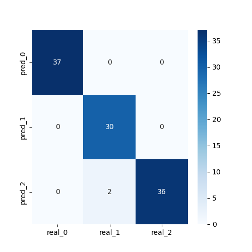 | 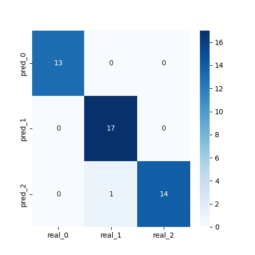 |

### Problema real 5

En este caso, presentamos los resultados para $2$, $5$, $10$ y $20$ neuronas. En este caso, los resultados entre $5$ y $10$ neuronas son muy parejos, aunque parecen muy ligeramente superiores para $10$ neuronas. Además, en $20$ neuronas es muy claro el *overfitting*. Por esto, como $10$ es el último mejor resultado y su rendimiento es algo superior, los consideramos como el mejor modelo.

|  LR  | Épocas | Neuronas |                          ECM                           |                          Accuracy                           |
| :--: | :----: | :------: | :----------------------------------------------------: | :---------------------------------------------------------: |
| 0.01 |  500   |    2     | 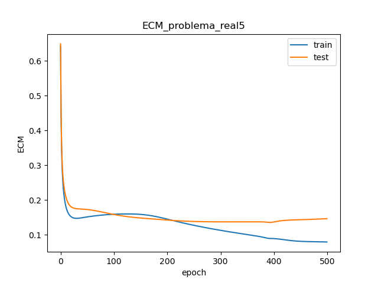  | 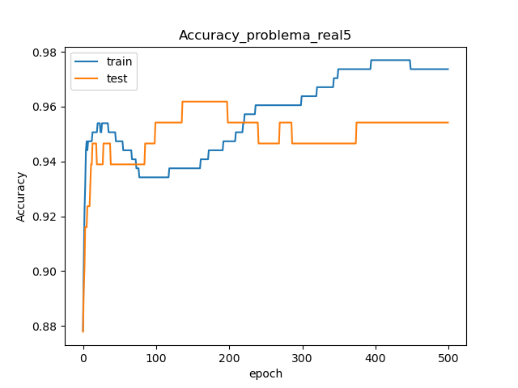  |
| 0.01 |  500   |    5     | 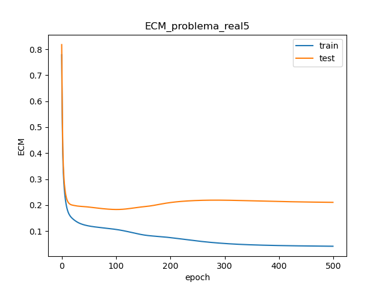  | 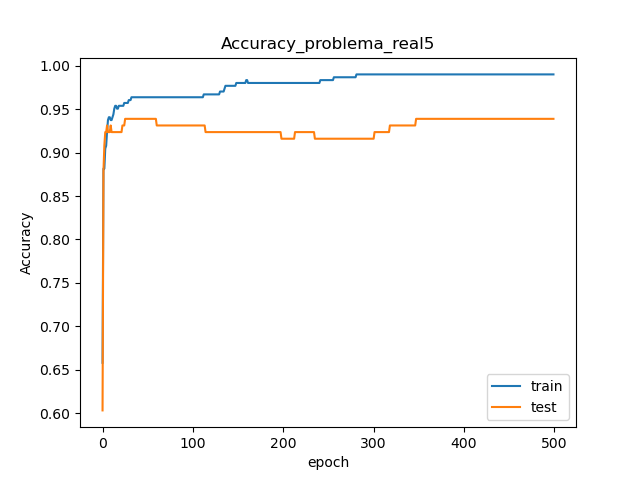  |
| 0.01 |  500   |    10    | 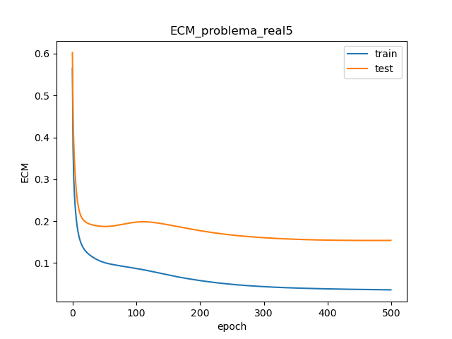 | 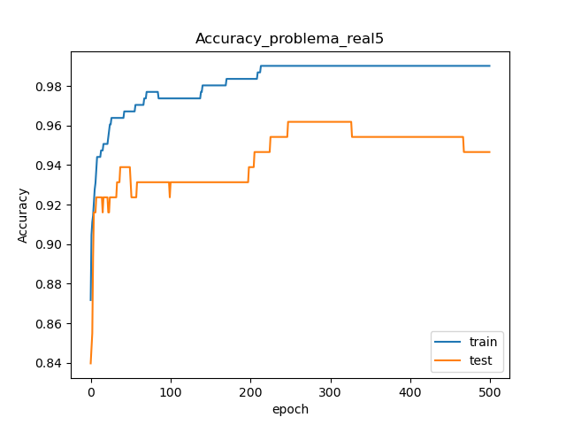 |
| 0.01 |  500   |    20    | 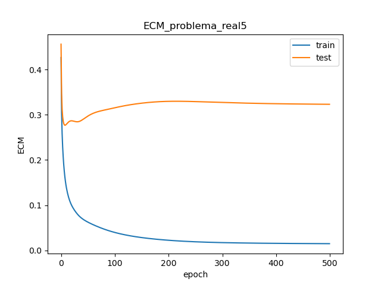 |  |

La matriz de confusión para el modelo de $10$ neuronas se presenta a continuación. Observamos como una vez más los falsos positivos superan a los falsos negativos.

|                 Matriz de confusión (train)                  |                  Matriz de confusión (val)                   |
| :----------------------------------------------------------: | :----------------------------------------------------------: |
| 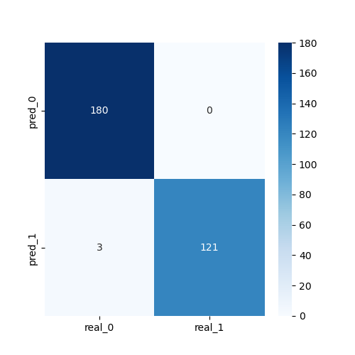 | 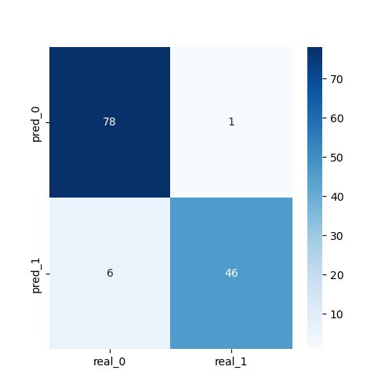 |

## 3. Problemas reales y normalización

Como se indica en el enunciado, para los problemas $4$ y $6$ no es posible encontrar una configuración que dé buenos resultados. A continuación mostramos los resultados de rendimiento para una de las configuraciones que hemos probado:

|                      Problema 4                       |                      Problema 6                       |
| :---------------------------------------------------: | :---------------------------------------------------: |
| 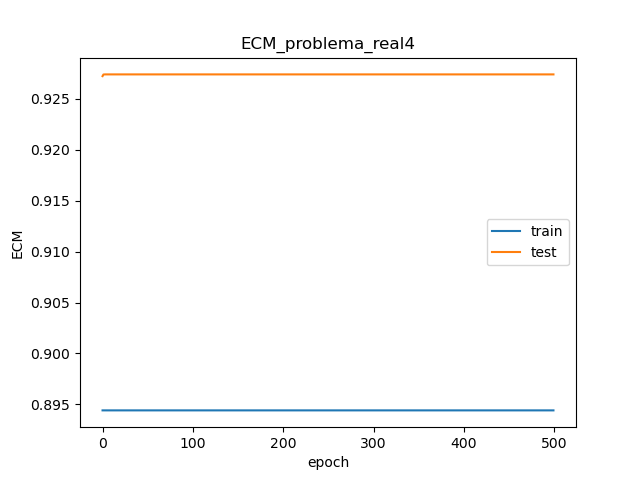 | 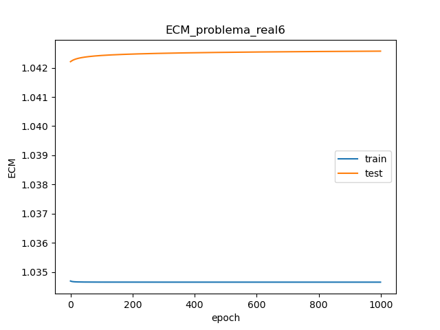 |

Para determinar la causa de que la red no sea capaz de aprender, hemos observado la distribución de las variables de entrada. Creemos que el *boxplot* es una buena forma de agrupar la información que queremos observar y de poder ver diferencias entre las distintas variables. Además, incluimos la gráfica para otros problemas sí resolubles (el $1$ y el $2$) para comprobar porqué el $4$ y el $6$ no lo son.

|           Problema 1           |           Problema 2           |           Problema 4           |           Problema 6           |
| :----------------------------: | :----------------------------: | :----------------------------: | :----------------------------: |
| 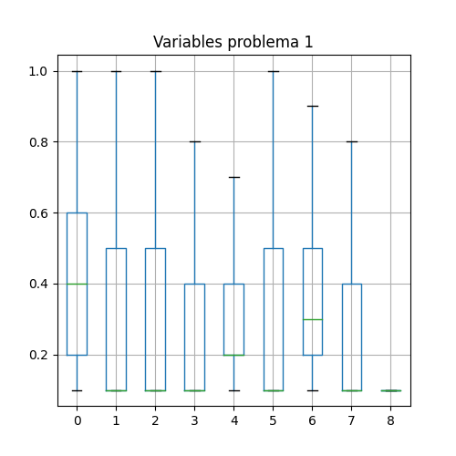 |  | 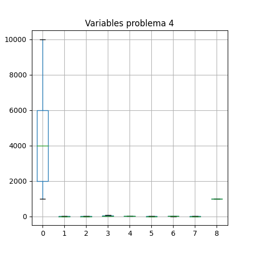 | 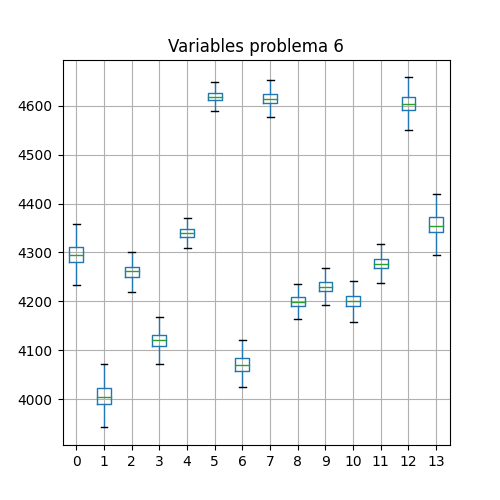 |

En la figura anterior podemos ver con claridad la razón que causa que los primeros dos problemas sean resolubles pero los dos siguientes no. Las variables del problema $1$ y el $2$ están definidas en el intervalo $[0,1]$, con medias y varianzas parejas. Sin embargo, en el problema $4$, el intervalo de definición de la primera variable es mucho mayor que el de las demás, además de contar con una varianza muy superior. Esta variable claramente dificultará el aprendizaje, ya que los pesos deberán adaptarse a esta entrada tan distinta del resto, a la que al principio se le dará demasiada importancia al tener más magnitud. En cuanto al problema $6$, cada variable presenta un intervalo de definición y varianza distintas. El problema más importante es el hecho de la magnitud de todas las variables, muy superior a las de los problemas $1$ y $2$. Esto causará que los pesos deban ser reducidos enormemente para adaptarse, lo que dificultará la convergencia.

Como solución, procedemos a normalizar los valores de entrada como sigue:
$$
X_{train} = \frac{X_{train} - \mu_{train}}{\sigma_{train}}\\
X_{test} = \frac{X_{test} - \mu_{train}}{\sigma_{train}},
$$

es decir, las entradas del conjunto de test son normalizadas con la media y la desviación del conjunto de entrenamiento.

### Problema real 4 

Comprobamos ahora que la normalización es efectiva en el problema $4$. En la siguiente tabla observamos los resultados para $2$ y $5$ neuronas, muy superiores a los que hemos visto unas líneas más arriba.

|  LR  | Épocas | Neuronas |                            ECM                             |                           Accuracy                           |
| :--: | :----: | :------: | :--------------------------------------------------------: | :----------------------------------------------------------: |
| 0.01 |  500   |    2     | 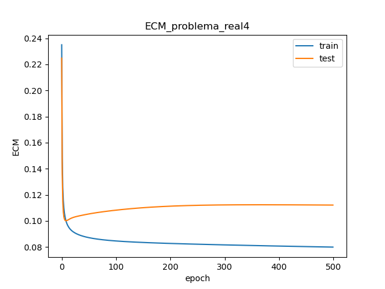 | 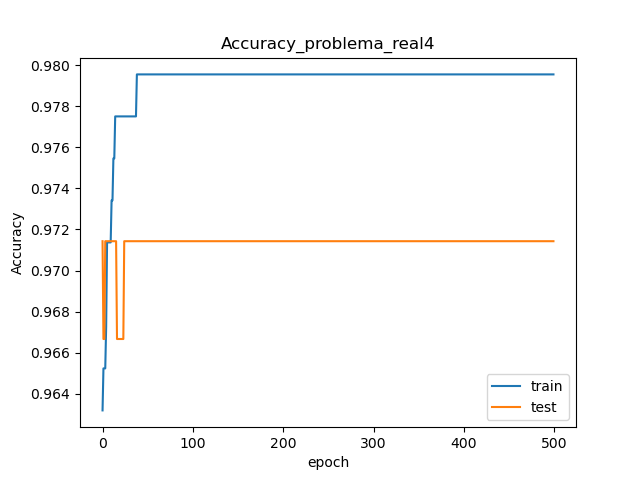 |
| 0.01 |  500   |    5     | 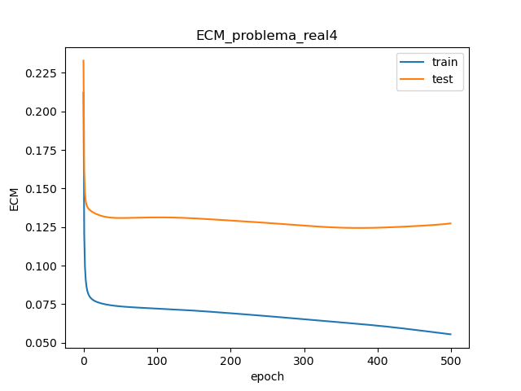 | 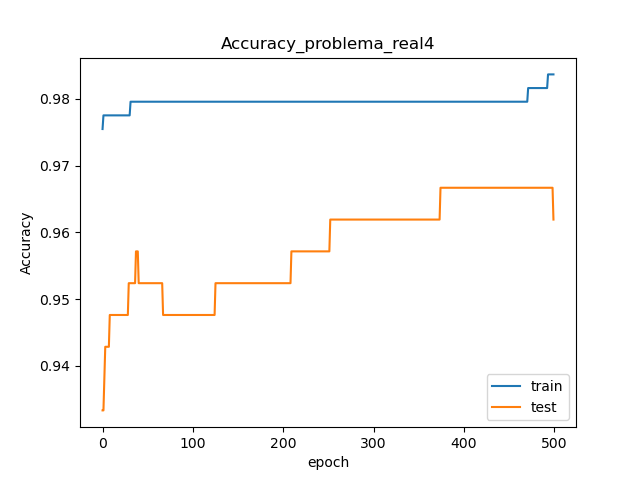 |

### Problema real 6

En primer lugar, tal y como se nos pide en el enunciado, ejecutamos el problema $6$ con la configuración solicitada. Cabe comentar que el tiempo de ejecución fue de **2 horas y 8 minutos**, demostrando la eficiencia de Julia. Los resultados son los siguientes:

|  LR  | Épocas | Neuronas |                             ECM                             |                           Accuracy                           |
| :--: | :----: | :------: | :---------------------------------------------------------: | :----------------------------------------------------------: |
| 0.1  |  5000  |    20    | 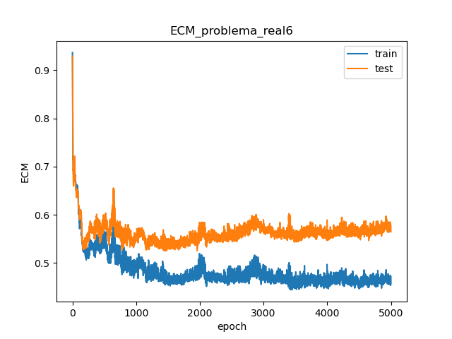 | 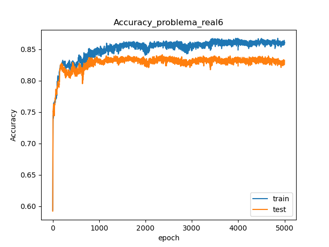 |

Observamos cómo, al igual que en el problema $4$, el modelo es capaz de aprender tras normalizar los datos de entradas. Además, hemos obtenido las matrices de confusión para esta configuración:

|                 Matriz de confusión (train)                  |                  Matriz de confusión (val)                   |
| :----------------------------------------------------------: | :----------------------------------------------------------: |
| 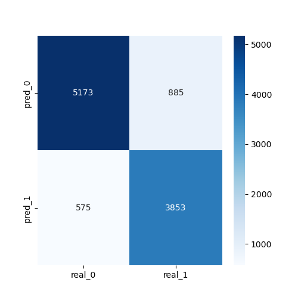 | 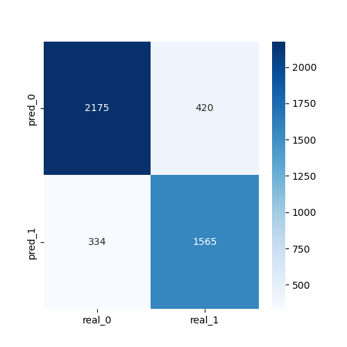 |

Una vez más, la tendencia de errores es la misma en el conjunto de entrenamiento que en el conjunto de validación. Parece que en este caso, la clase $0$ está sobre-representada, de ahí que haya más falsos negativos.

A continuación, presentamos los resultados para distintas variaciones en el número de neuronas de la configuración que se nos solicitaba con $1000$ épocas. Observamos cómo el rendimiento va creciendo notablemente según aumentamos el número de neuronas hasta 20. Sin embargo, el aumento de complejidad hasta 30 neuronas es excesivo ya que no se producen mejoras y, de hecho, se obtiene un rendimiento ligeramente inferior.

|  LR  | Épocas | Neuronas |                             ECM                             |                           Accuracy                           |
| :--: | :----: | :------: | :---------------------------------------------------------: | :----------------------------------------------------------: |
| 0.1  |  1000  |    2     | 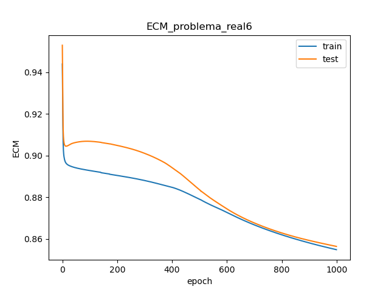  | 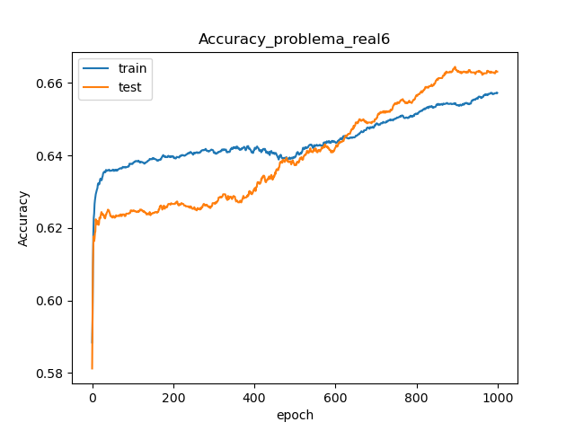 |
| 0.1  |  1000  |    5     | 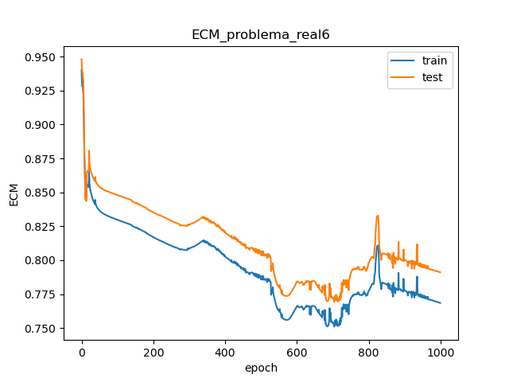  | 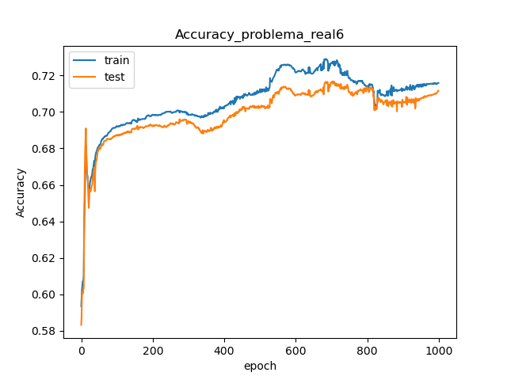 |
| 0.1  |  1000  |    10    | 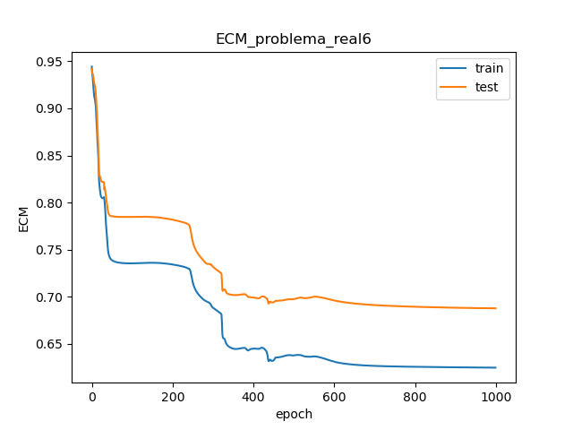 | 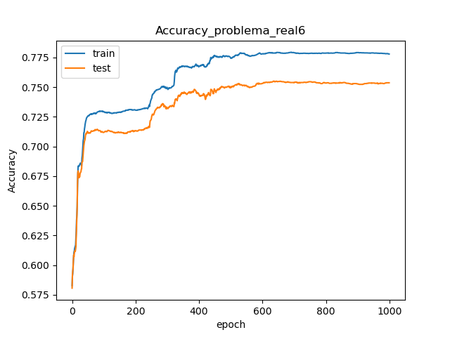 |
| 0.1  |  1000  |    20    |  | 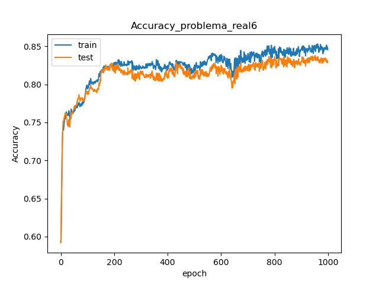 |
| 0.1  |  1000  |    30    | 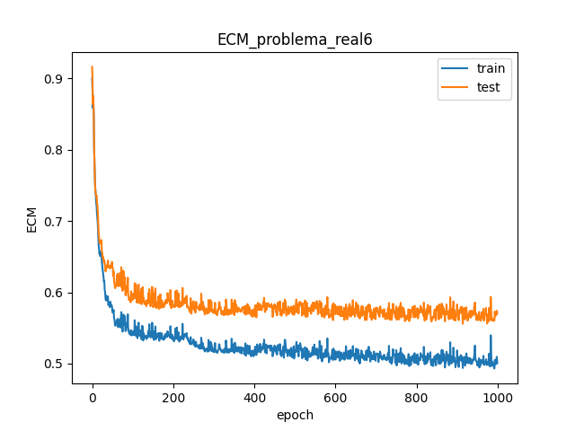 | 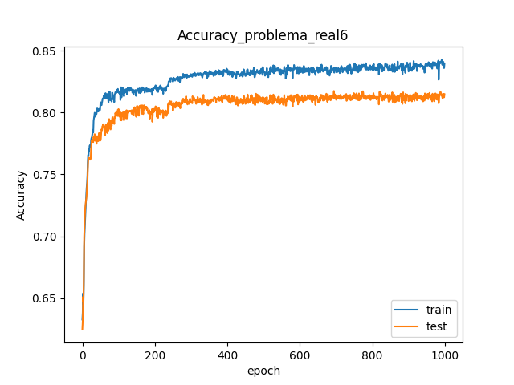 |

Como es evidente que este es el problema más desafiante de todos, hemos decidido probar la funcionalidad de varias capas sobre este conjunto de datos. Los resultados se muestran en la siguiente tabla:

|  LR  | Épocas |  Neuronas  |                             ECM                              |                           Accuracy                           |
| :--: | :----: | :--------: | :----------------------------------------------------------: | :----------------------------------------------------------: |
| 0.1  |  1000  |  [10, 10]  | 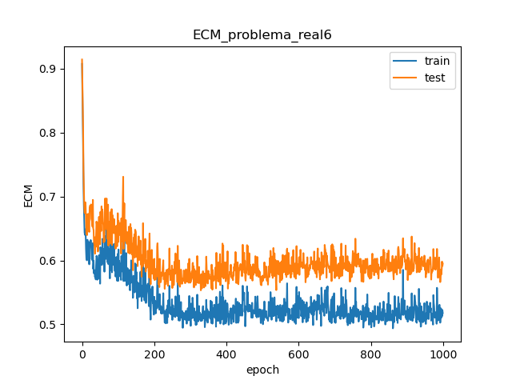 | 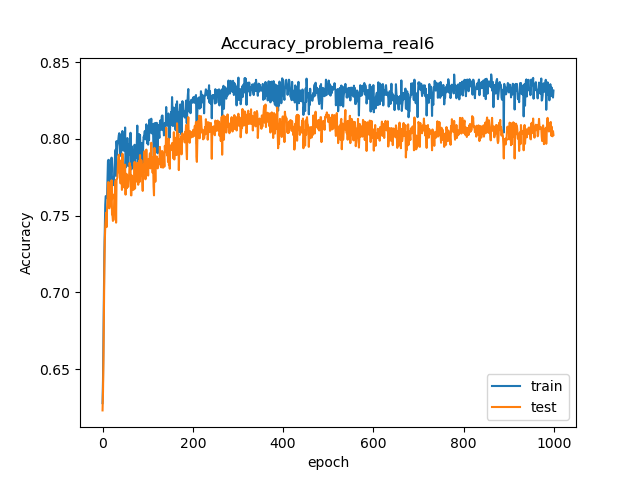 |
| 0.1  |  1000  | [5, 5, 5]  | 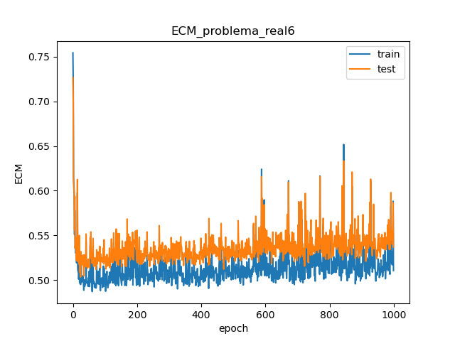 | 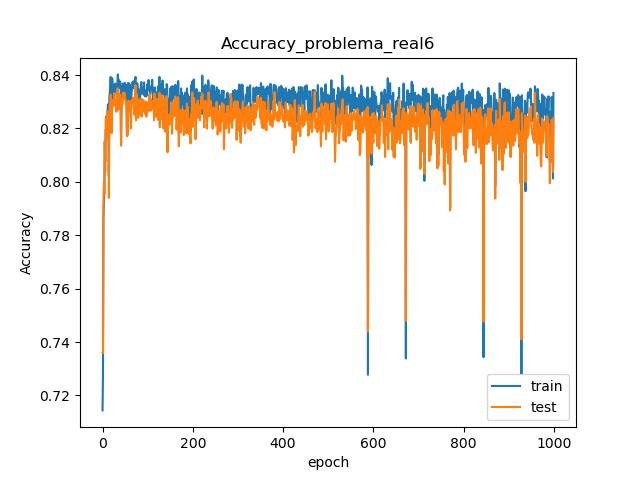 |
| 0.1  |  1000  | [5, 10, 5] | 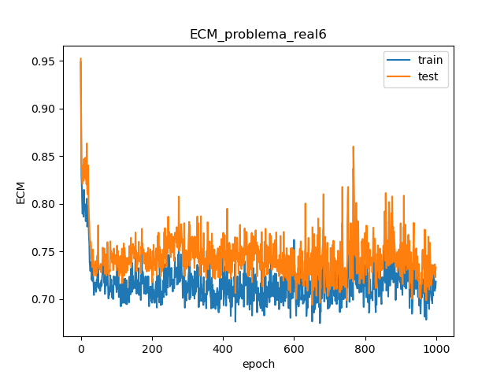 | 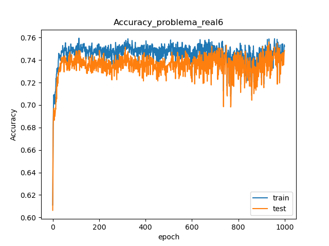 |

Con dos capas ocultas de $10$ neuronas cada una, el rendimiento es similar al de una sola capa. Sin embargo, si añadimos una tercera capa oculta, la complejidad del modelo es tal que parece impedir que se aproveche el mayor número de parámetros para un mejor aprendizaje. También es reseñable destacar, combinando estos resultados con los de 20 y 30 neuronas, que estos modelos con mayor complejidad tienen una variabilidad mayor a la hora de entrenar, con subidas y bajadas del ECM y Accuracy.

Por último, como en las pruebas realizadas con los otros problemas el LR fijado a $0.01$ parecía tener un rendimiento superior, hemos decidido hacer probar a modificar este parámetro en la configuración solicitada.

|  LR  | Épocas | Neuronas |                             ECM                              |                           Accuracy                           |
| :--: | :----: | :------: | :----------------------------------------------------------: | :----------------------------------------------------------: |
| 0.01 |  1000  |    20    | 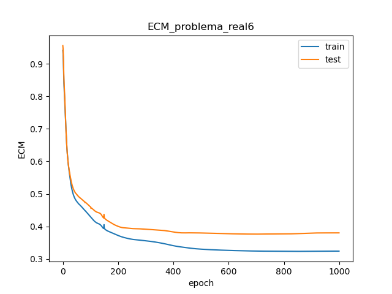 | 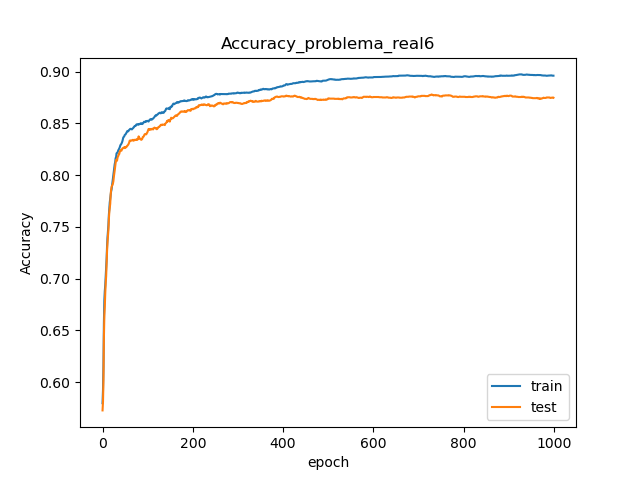 |

Para $1000$ épocas el rendimiento es muy superior al de la configuración solicitada, por lo que hemos decidido ejecutarlo para $5000$ épocas. Estos resultados, similares, se muestran a continuación:

|  LR  | Épocas | Neuronas |                             ECM                              |                           Accuracy                           |
| :--: | :----: | :------: | :----------------------------------------------------------: | :----------------------------------------------------------: |
| 0.01 |  5000  |    20    | 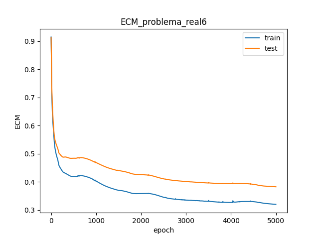 | 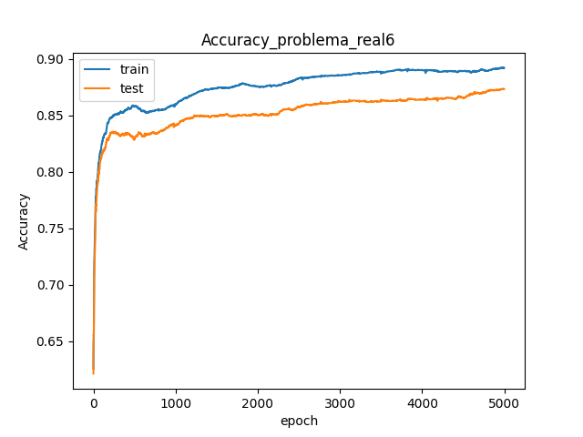 |

Podemos ver que esta vez el entrenamiento se ha realizado de manera más lenta, pero obteniendo un resultado similar, mejor que el del esquema propuesto. También, otro aspecto positivo de reducir la tasa de aprendizaje es que el entrenamiento no tiene tanta variabilidad como en los modelos complejos con tasa $0.1$, quedando claro que esa tasa producía variaciones en los pesos excesivas en cada entrenamiento.